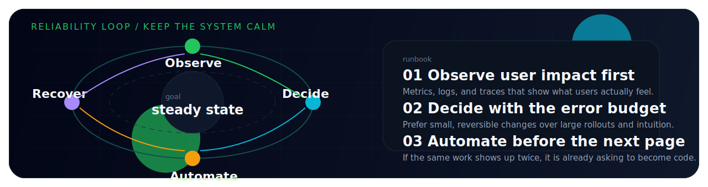
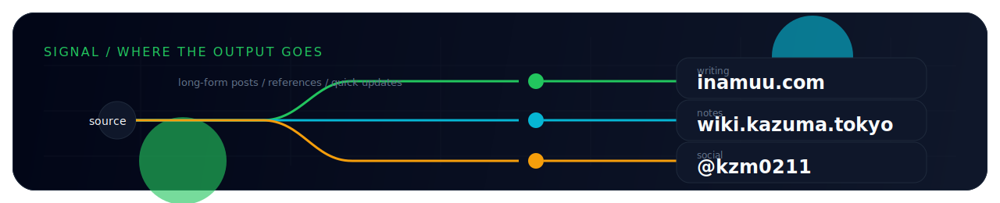

  

  
  
  

  
  
  
  

  <strong>Production-first software engineer in Saitama.</strong> 
  Reliability, observability, Terraform, and platform automation.

> Keep systems boring. Ship small. Automate the repeatable.

## Operating Manual

<table>
  <tr>
    <td width="48%" valign="top">

<h3><code>control-plane.yaml</code></h3>

<pre lang="yaml"><code>
name: inamuu
role: software engineer
stance: sre-minded
base: Saitama, Japan
timezone: JST
focus:
  - AWS
  - Kubernetes
  - Terraform
  - observability
  - platform automation
mission: reduce toil and ship reliable systems
</code></pre>

  </td>
    <td width="52%" valign="top">

<h3><code>current_focus</code></h3>

<ul>
  <li>Designing boring systems that stay predictable in production</li>
  <li>Turning operational knowledge into repeatable automation</li>
  <li>Going deeper on AWS, Kubernetes, and Terraform every day</li>
  <li>Increasing delivery speed without adding reliability debt</li>
</ul>

<h3><code>operating_principles</code></h3>

<ul>
  <li>Measure user impact before tuning internals</li>
  <li>Protect the error budget and keep releases reversible</li>
  <li>If an operation repeats, write the code that removes it</li>
</ul>

  </td>
  </tr>
</table>

## Reliability Loop

  

## Stack

  
  
  
  
  
  
  

## Telemetry

  
  

<code>runbook.md</code>

- Measure what users feel before tuning internals
- Protect the error budget and make change failure cheap
- Prefer small, reversible releases over big heroic launches
- If an operation repeats, turn it into code before the next incident

## Signal

  

  <a href="https://inamuu.com"><strong>inamuu.com</strong></a>
  ·
  <a href="https://wiki.kazuma.tokyo"><strong>wiki.kazuma.tokyo</strong></a>
  ·
  <a href="https://twitter.com/kzm0211"><strong>@kzm0211</strong></a>

