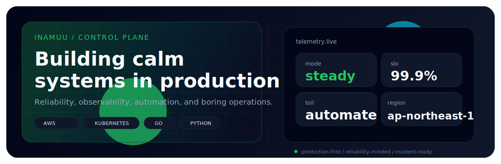

<p align="center">
  
</p>

<h1 align="center">inamuu</h1>

<p align="center">
  Production-first software engineer in Saitama.<br />
  I care about reliability, observability, automation, and keeping systems calm under load.
</p>

<p align="center">
  <a href="https://inamuu.com">
    
  </a>
  <a href="https://wiki.kazuma.tokyo">
    
  </a>
  <a href="https://twitter.com/kzm0211">
    
  </a>
</p>

<p align="center">
  
  
  
  
</p>

## Control Plane

```yaml
role: software engineer
stance: sre-minded
location: Saitama, Japan
focus:
  - AWS
  - Kubernetes
  - Terraform
  - observability
  - platform automation
languages:
  - Go
  - Python
  - TypeScript
mission: reduce toil and ship reliable systems
```

## Reliability Loop

| Layer | What I optimize for |
| --- | --- |
| Observe | Metrics, logs, traces, and dashboards that explain user impact |
| Decide | SLO-aware tradeoffs instead of intuition-only operations |
| Automate | Scripts, tooling, and runbooks that delete repeated manual work |
| Recover | Small blast radius, fast rollback, and calm incident response |

## Current Focus

- Designing boring systems that stay predictable in production
- Turning operational knowledge into repeatable automation
- Going deeper on AWS, Kubernetes, and Terraform for resilient platform design
- Improving delivery speed without paying for it in reliability debt

## Stack

<p>
  
  
  
  
  
  
  
</p>

## Telemetry

<p align="center">
  
  
</p>

<details>
<summary><code>runbook.md</code></summary>

- Measure what users feel before tuning internals
- Protect the error budget and make change failure cheap
- Prefer small, reversible releases over big heroic launches
- If an operation repeats, turn it into code before the next incident

</details>

## Signal

- Writing: [inamuu.com](https://inamuu.com)
- Notes: [wiki.kazuma.tokyo](https://wiki.kazuma.tokyo)
- Social: [@kzm0211](https://twitter.com/kzm0211)
